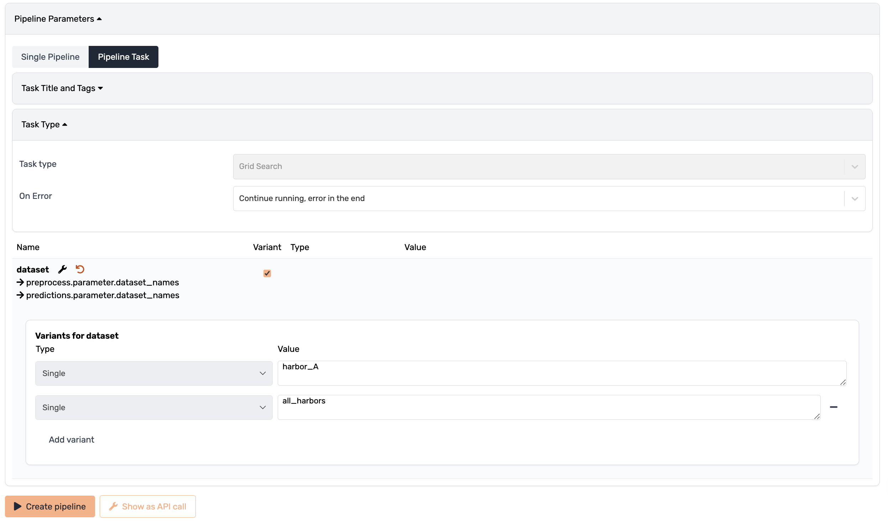
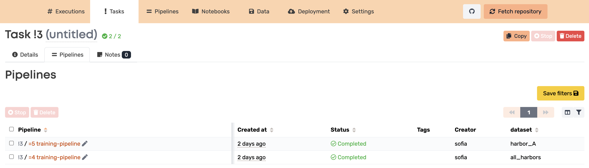

# Valohai Dynamic Pipelines

## Overview
This project demonstrates advanced usage of Valohai pipelines to automate machine learning workflows. It showcases how to effectively run hyperparameter tuning and scale pipelines for training machine learning models on different datasets. The project is tailored for those interested in automating their machine learning operations across different environments such as edge devices, online platforms, and mobile.

## Features
- **Hyperparameter Tuning**: Automate the tuning of model parameters within a pipeline to optimize performance.
- **Scalable Training**: Extend pipelines to train models on various datasets, accommodating different contexts like multiple patients, devices, or vehicles.
- **Parallel Execution**: Execute multiple steps such as model training and tuning concurrently to speed up the development cycle.
- **Production-Ready**: Set up triggers for regular pipeline executions, ensuring models are up-to-date and performant in production environments.

## Ideal Use Case
This solution is perfect for customers looking to:
- Scale model training across multiple datasets or contexts.
- Automate and streamline their machine learning workflows.
- Deploy models across various environments with differing computational needs.

## Running the Project
### Login and Configure Repository
- Log in to the [Valohai app](https://app.valohai.com/) and create a new project.
- Configure this repository as the project's repository:
    - Go to your project's page.
    - Navigate to the Settings tab.
    - Under the Repository section, locate the URL field.
    - Enter the URL of this repository.
    - Click on the Save button.

### Running Executions
- Go to the Executions tab in your project.
- Create a new execution by selecting the predefined steps.
- Customize the execution parameters if needed.
- Start the execution.

### Running Pipelines
- Navigate to the Pipelines tab.
- Create a new pipeline by selecting the blueprint of the pipeline.
- Configure the pipeline settings.
- Start the pipeline.

You can also convert this pipeline into a **Pipeline Task** when creating a pipeline.

What you will end up having is a Task that consists of multiple pipelines.

## Acknowledgements
The example here is based on the Ship classification Notebook by [Arpit Jain](https://www.kaggle.com/code/arpitjain007/ship-classification/notebook). 
The dataset is available [here](https://www.kaggle.com/datasets/arpitjain007/game-of-deep-learning-ship-datasets).
